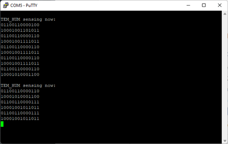
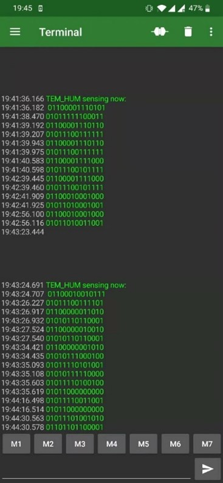
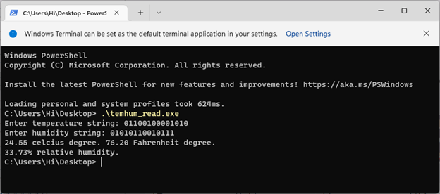

## Feature
- Simulate and synthesized by Vivado, clock frequency of FPGA board is 100 MHZ
- Data measured by sensor is passed to board by I2C, then stored on register
- 14-bit resolution of raw data is processed on board into human readable format
- Result is displayed on another smart device via UART communication protocol

## Architecutre
Table below illustrates the module hierarchy of the project:
|Top Module||Major component|||
|:---:|:---:|:---:|:---:|:---:|
|GPIO|→|Debouncer|
|| →|UART_TX_CTRL|
|| →|pmod_hygrometer|→|i2c_master|
|| →|Binary_to_BCD|
|--- Constraint--- |---|---|---|---|
|Arty_Master.xdc|
<!-- ← → ↑ ↓ -->
## Demonstration
 
#### Screenshot of raw data print on putty in Windows platform

 
#### Screenshot of raw data print on Serial terminal on Android platform

 
#### Read the temperature and humidity through an executable file on Windows OS

## Reference
- ArtyA7 reference manual posted by Digilent\
https://digilent.com/reference/programmable-logic/arty-a7/start?redirect=1
- Datasheet of Pmod HYGRO Digital Humidity and Temperature Sensor\
https://digilent.com/shop/pmod-hygro-digital-humidity-and-temperature-sensor/
- Pmod interface specification\
https://digilent.com/reference/_media/reference/pmod/digilent-pmod-interface-specification.pdf
- TI HDC1080 Low Power, High Accuracy Digital Humidity Sensor with Temperature Sensor\
https://www.ti.com/lit/ds/symlink/hdc1080.pdf
- GPIO driver in VHDL\
https://github.com/Digilent/Arty-A7-100-GPIO/tree/master/src/hdl
- UART_TX communication protocol in VHDL\
https://github.com/Digilent/Arty-A7-100-GPIO/blob/master/src/hdl/UART_TX_CTRL.vhd
- Pmod HYGRO sensor driver in VHDL\
https://forum.digikey.com/t/humidity-and-temperature-sensor-pmod-controller-vhdl/13064
- Binary to BCD module in VHDL, includes integer part only\
https://www.nandland.com/vhdl/modules/double-dabble.html
- STL_LOGIC_VECTOR to ASCII in VHDL\
http://computer-programming-forum.com/42-vhdl/838e970e310e791c.htm
- String to ASCII in VHDL\
https://stackoverflow.com/questions/22900938/vhdl-is-there-a-convenient-way-to-assign-ascii-values-to-std-logic-vector
